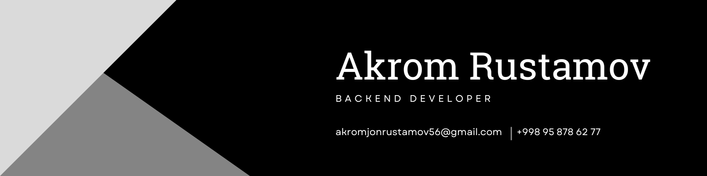
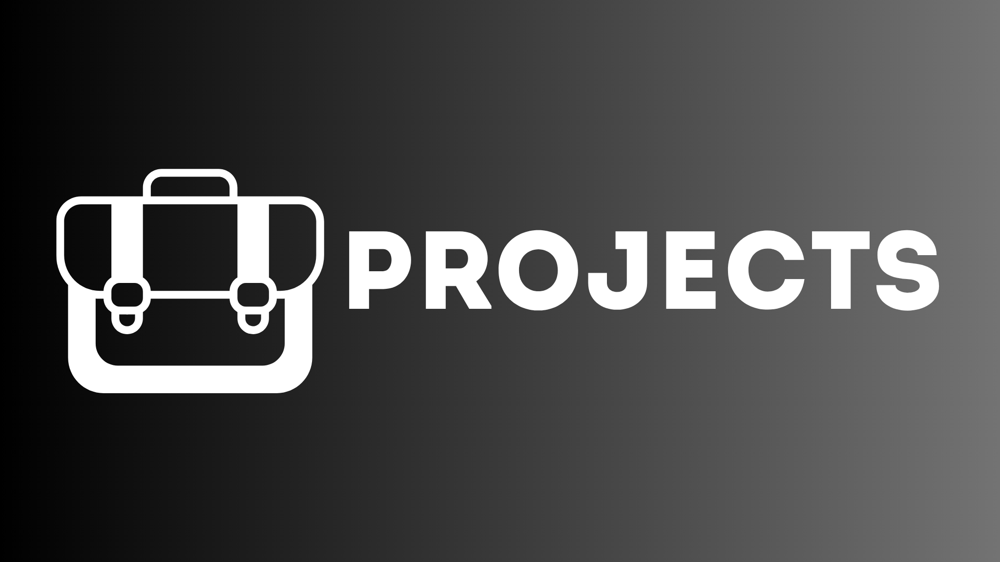
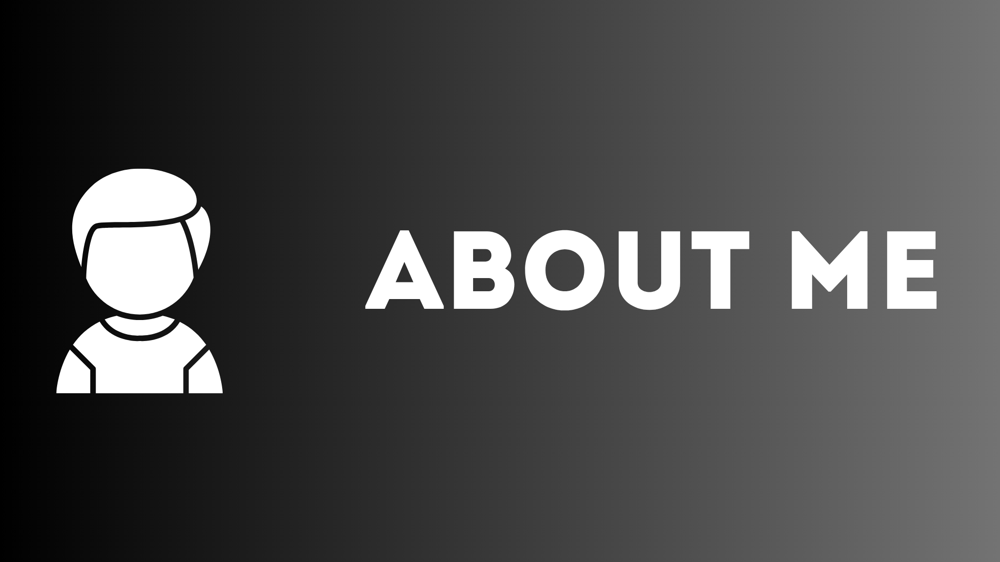
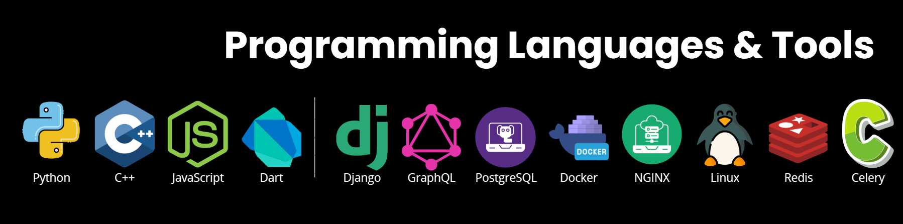
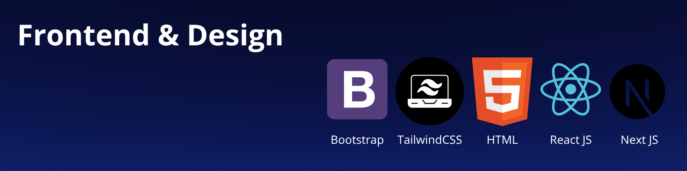

<!-- ========================= -->
<!--   DARK—SEAMLESS README    -->
<!-- ========================= -->

<!-- ANIMATED TYPING TITLE -->

  

<!-- SNAKE CONTRIBUTION GRID -->

  

<!-- MAIN HEADER BANNER -->

  

 

<!-- ========================= -->
<!--       NAVIGATION          -->
<!-- ========================= -->

<table align="center" cellpadding="8">
  <tr>
    <td align="center"></td>
    <td align="center"></td>
    <td align="center"></td>
    <td align="center"></td>
    <td align="center"></td>
  </tr>
</table>

 

<!-- ========================= -->
<!--       TROPHIES            -->
<!-- ========================= -->

  

 

<!-- ========================= -->
<!--       GITHUB STATS        -->
<!-- ========================= -->

  <table align="center" cellpadding="8">
    <tr>
      <td align="center">
        
      </td>
      <td align="center">
        
      </td>
    </tr>
    <tr>
      <td align="center" colspan="2">
        
      </td>
    </tr>
  </table>

 

<!-- ========================= -->
<!--        BANNER #2          -->
<!-- ========================= -->

  

 

<!-- ========================= -->
<!--      SOCIAL BADGES        -->
<!-- ========================= -->

  
  
  
  

 

<!-- ========================= -->
<!--        BANNER #3          -->
<!-- ========================= -->

  

 

<!-- ========================= -->
<!--     VISITOR COUNTER       -->
<!-- ========================= -->

  
   
  welcome to my developer universe

 

<!-- ========================= -->
<!--          FOOTER           -->
<!-- ========================= -->

  
   
  built with ♥ — Akrom

