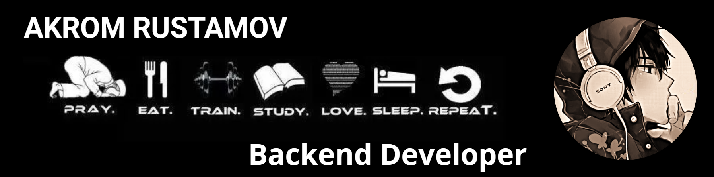

<!-- 🌌 HEADER BANNER -->

  

 

<!-- 🎯 MAIN LINKS -->

  
  
  
  
  

 

<!-- 🔥 STREAK STATS -->

  

<!-- 🛰️ SECOND BANNER -->

  

<!-- 📊 GITHUB STATS -->

  
  

<!-- 🌆 THIRD BANNER -->

  

<!-- 🤝 CONNECT SECTION -->

  <h3 style="color: #4FC1E9; font-family: 'Segoe UI', sans-serif; margin-bottom: 16px;">
    🌐 Connect with Me
  </h3>
  
  

    
    
    
    
  

  

    💬 Let’s connect and build something amazing together
  

 

<!-- 👁️ VISITOR COUNT -->

  

    
  

  

    ✨ You are visiting Akrom's profile — welcome to my developer universe ✨
  

